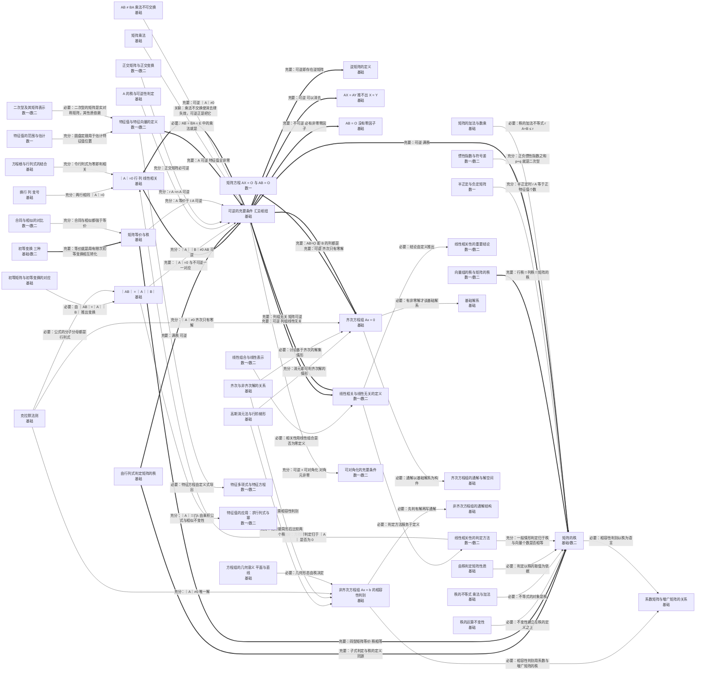
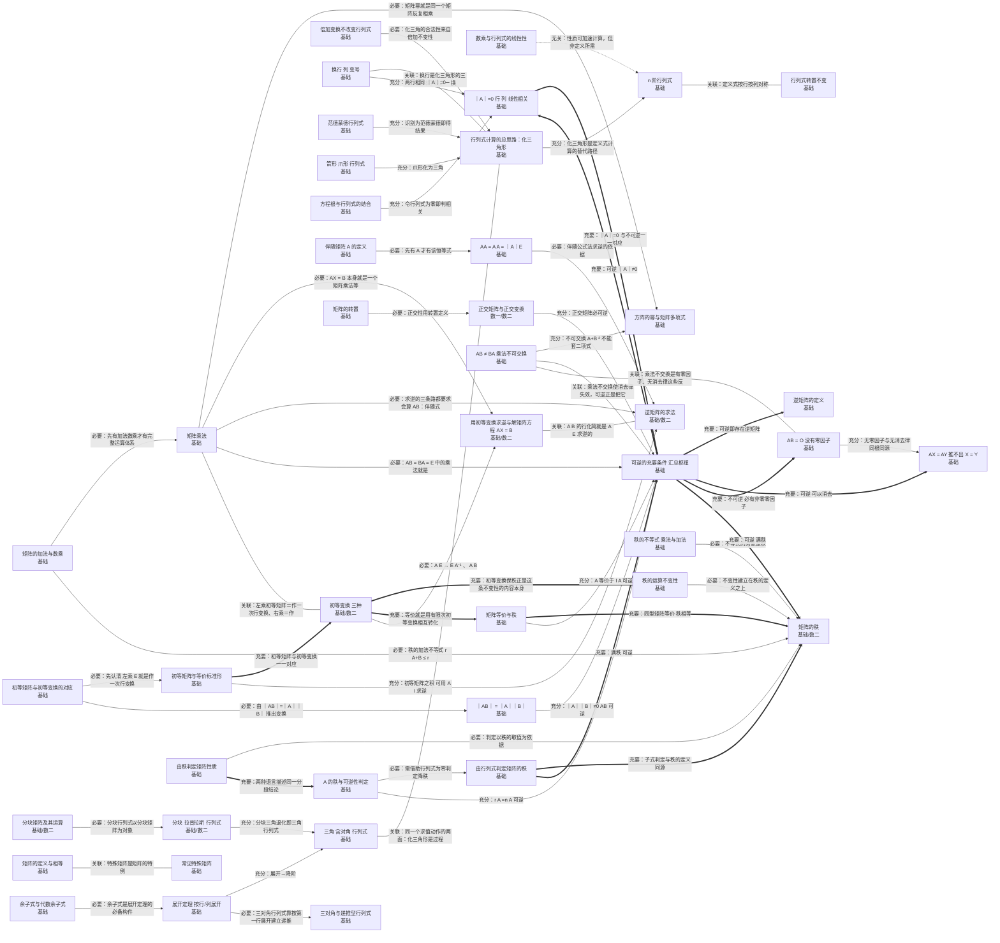
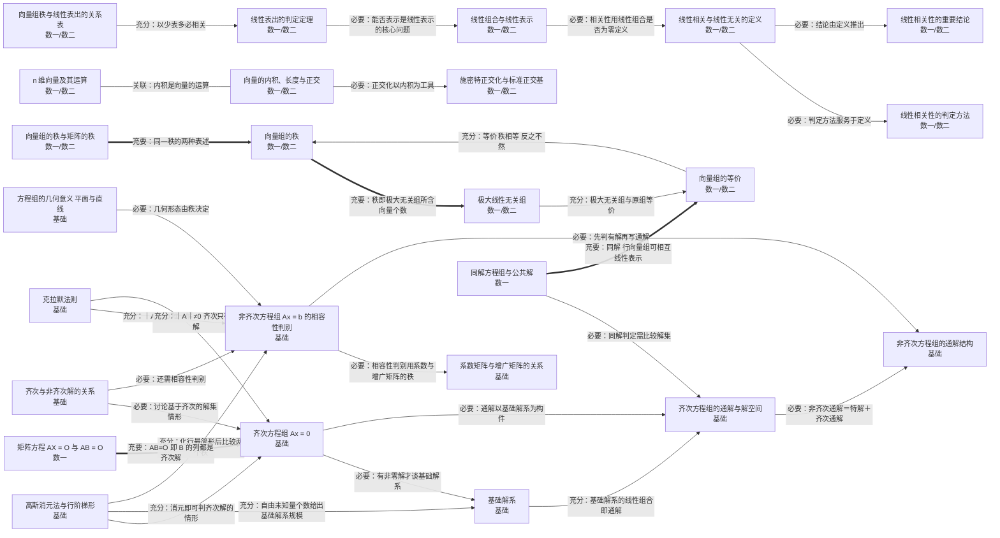
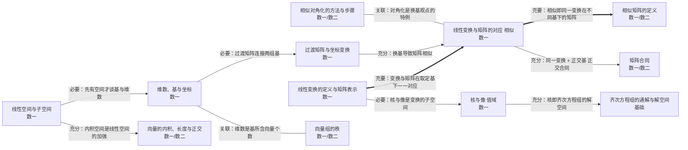

---
索引:
  - "[[00 线性代数知识网总览|00 线性代数知识网总览]]"
---

# 02 充分必要条件链（Mermaid）

> 箭头方向统一为「条件 ⇒ 结论」，箭头标签为该关系的类型。

## 读图规则

| 连线    | 含义     | 记忆要点         |                |                             |
| ------- | -------- | ---------------- | -------------- | --------------------------- |
| `A ==>  | 充要     | B`               | A ⇔ B          | 选择题中可**互相替换**          |
| `A -->  | 充分     | B`               | A ⇒ B 但 B ⇏ A | A 的条件**更强**                |
| `A -->  | 必要     | B`               | B ⇒ A 但 A ⇏ B | A 是 B 的**必要条件**（A 更弱） |
| `A -.-> | 无关     | B`               | A、B 不能互推  | 常用来考**反例**                |
| `A --- B` | 概念关联 | 同源、构成、特例 |                |                             |

## 一、全局枢纽：可逆 ⇔ 满秩 ⇔ 无关 ⇔ 唯一解

## 二、行列式与矩阵

## 三、向量与线性方程组

## 四、特征值与二次型

```mermaid
graph LR
  %% 线型：==>充要  -->充分/必要(箭头方向即条件强弱)  -.->无关  ---概念关联
  K215["特征值与特征向量的定义<br/>数一/数二"]
  K216["特征多项式与特征方程<br/>数一/数二"]
  K217["特征子空间与特征向量的求法<br/>数一/数二"]
  K218["代数重数与几何重数<br/>数一/数二"]
  K219["特征值与特征向量的性质<br/>数一/数二"]
  K220["可对角化的充要条件<br/>数一/数二"]
  K221["相似对角化的方法与步骤<br/>数一/数二"]
  K222["用对角化求 Aᵏ 与矩阵函数<br/>数一/数二"]
  K223["相似矩阵的定义<br/>数一/数二"]
  K224["相似矩阵的性质与不变量<br/>数一/数二"]
  K225["相似的判定与反例<br/>数一"]
  K226["特征值的运算性质<br/>数一/数二"]
  K227["特征值的应用：求行列式与幂<br/>数一/数二"]
  K228["实对称矩阵的特征值与特征向量<br/>数一/数二"]
  K229["实对称矩阵的正交对角化<br/>数一/数二"]
  K230["正交变换法化标准形<br/>数一/数二"]
  K231["最小多项式与可对角化<br/>数一"]
  K232["特征值的范围与估计<br/>数一"]
  K233["二次型及其矩阵表示<br/>数一/数二"]
  K234["标准形与规范形<br/>数一/数二"]
  K235["配方法化标准形<br/>数一/数二"]
  K236["惯性指数与符号差<br/>数一/数二"]
  K237["惯性定理<br/>数一/数二"]
  K238["矩阵合同<br/>数一/数二"]
  K239["合同与相似的对比<br/>数一/数二"]
  K240["正定二次型与正定矩阵<br/>数一/数二"]
  K241["瑞利商定理<br/>数一/数二"]
  K242["正定的充要条件 五条等价<br/>数一/数二"]
  K243["半正定与负定矩阵<br/>数一"]
  K215 -->|必要：特征方程由定义式导出| K216
  K216 -->|必要：先求 λ 再求特征向量| K217
  K217 -->|充分：解空间维数即几何重数| K218
  K218 -->|充分：几何重数≤代数重数 特征向量不够则不| K219
  K219 -->|必要：判定对角化需数线性无关特征向量的个数| K220
  K218 ==>|充要：几何重数＝代数重数 可对角化| K220
  K220 -->|必要：先判可对角化再作对角化| K221
  K221 -->|充分：对角化后立得幂与矩阵函数| K222
  K223 -->|必要：性质由相似定义推出| K224
  K224 -->|充分：不变量不同即可判不相似| K225
  K223 -->|充分：A 相似于对角阵 A 可对角化| K220
  K226 -->|充分：代入法即得 ｜A+kI｜ 与 A 的| K227
  K228 ==>|充要：实对称矩阵必可正交对角化，反之亦然| K229
  K229 ---|关联：正交对角化 QᵀAQ＝Λ 正是正交变| K230
  K228 -->|充分：特征值相同 实对称矩阵相似| K224
  K231 ==>|充要：最小多项式无重根 可对角化| K220
  K232 -->|充分：圆盘定理用于估计特征值位置| K215
  K233 -->|必要：二次型的矩阵是实对称矩阵，其性质依赖| K215
  K233 -->|必要：化标准形以二次型为对象| K234
  K235 -->|充分：配方法给出标准形| K234
  K230 -->|充分：正交变换法给出标准形| K234
  K230 ---|关联：正交变换法就是正交对角化的算法外壳：| K229
  K234 -->|必要：惯性指数由标准形平方项符号统计| K236
  K236 ==>|充要：惯性指数不变 规范形唯一| K237
  K237 ==>|充要：实对称矩阵合同 惯性指数分别相同| K238
  K238 -.->|无关：合同 CᵀAC 与相似 P⁻¹AP | K223
  K239 -->|必要：对比以合同为一方| K238
  K239 -->|必要：对比以相似为另一方| K223
  K240 -->|必要：正定性用标准形符号刻画| K234
  K230 -->|必要：把分母 xᵀx 抹平要靠正交变换：标| K241
  K234 -->|必要：标准形的系数就是特征值，瑞利商的两个| K241
  K241 ==>|充要：瑞利商恒大于零 最小特征值大于零 A| K242
  K241 ---|关联：同一条不等式的两种用法：瑞利商给二次| K232
  K240 -->|必要：充要条件是判定的展开| K242
  K242 ==>|充要：正定 p＝n| K236
  K242 ==>|充要：正定 特征值全为正| K228
  K242 -->|必要：半正定判据由正定放宽得到| K243
```

## 五、线性空间与线性变换

返回：[[00 线性代数知识网总览]]