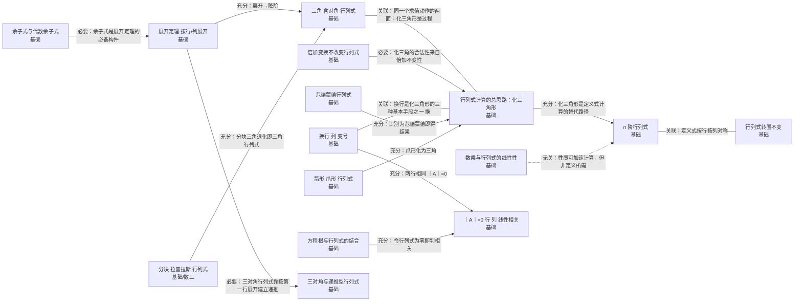

# 第一章 行列式

> 基础/数一/数二 均要求。核心：行列式的性质、展开定理与计算方法，是判定可逆、克拉默法则与特征值的基础。

## 知识点清单

| 知识点                       | 层次      | 一句话要点                                                                       |
| ---------------------------- | --------- | -------------------------------------------------------------------------------- |
| [[n 阶行列式]]                   | `基础`      | ｜A｜ = Σ(−1)^τ(j₁j₂…jₙ)a₁ⱼ₁a₂ⱼ₂…aₙⱼₙ，n! 项代数和；τ 为列标排列的逆序数。       |
| [[行列式转置不变]]               | `基础`      | ｜Aᵀ｜ = ｜A｜：行列式的行与列地位完全对称。                                     |
| [[换行（列）变号]]               | `基础`      | 互换两行（列），行列式变号；两行（列）完全相同 ⇒ ｜A｜=0。                       |
| [[数乘与行列式的线性性]]         | `基础`      | 某一行乘 k ⇒ 行列式乘 k；某行是两组数之和 ⇒ 行列式可拆成两个行列式之和。         |
| [[倍加变换不改变行列式]]         | `基础`      | 把某行（列）的 k 倍加到另一行（列），行列式值不变。                              |
| [[三角（含对角）行列式]]         | `基础`      | 上（下）三角行列式 = 主对角线元素之积：｜A｜ = a₁₁a₂₂…aₙₙ。                      |
| [[余子式与代数余子式]]           | `基础`      | Mᵢⱼ 为划去第 i 行第 j 列所得 n−1 阶行列式；Aᵢⱼ = (−1)^{i+j}Mᵢⱼ。                 |
| [[展开定理（按行／列展开）]]     | `基础`      | ｜A｜ = Σⱼ aᵢⱼAᵢⱼ（按第 i 行展开）；异乘变零：Σⱼ aᵢⱼA_kⱼ = 0 (i≠k)。             |
| [[｜A｜=0 ⇔ 行（列）线性相关]]   | `基础`      | ｜A｜= 0 ⇔ A 的列（行）向量组线性相关 ⇔ A 不可逆 ⇔ r(A) < n。                    |
| [[由行列式判定矩阵的秩]]         | `基础`      | r(A) = r ⇔ 存在 r 阶子式非零而所有 r+1 阶子式全为零。                            |
| [[｜AB｜ = ｜A｜｜B｜]]          | `基础`      | 同阶方阵乘积的行列式等于行列式之积；对任意有限个方阵同样成立。                   |
| [[范德蒙德行列式]]               | `基础`      | Vₙ = ∏_{1≤j<i≤n}(xᵢ−xⱼ)，等于所有"后减前"型差积。                                |
| [[三对角与递推型行列式]]         | `基础`      | 形如主对角 a、次对角 b,c 的行列式满足 Dₙ = aD_{n−1} − bcD_{n−2}。                |
| [[箭形（爪形）行列式]]           | `基础`      | 第一行、第一列及主对角线非零的行列式；可用"消去第一行（列）的非对角元"化为三角。 |
| [[行列式计算的总思路：化三角形]] | `基础`      | 用倍加、换行、提公因子把行列式化为上三角，再由对角线之积得值。                   |
| [[方程根与行列式的结合]]         | `基础`      | 把方程写成含参数的行列式等于零，用行列式性质求根（如 f(x)=0 的根与重数）。       |
| [[分块（拉普拉斯）行列式]]       | `基础` `数二` | 对角分块：｜A O; O B｜ = ｜A｜｜B｜；副对角分块需乘以 (−1)^{mn} 的符号因子。     |

## 本章关系图（Mermaid）

## 跨章连接（本章与外部的充分必要关系）

| 起点                       | 关系   | 终点                       | 含义                                        |
| -------------------------- | ------ | -------------------------- | ------------------------------------------- |
| [[｜A｜=0 ⇔ 行（列）线性相关]] | 🟥 充要 | [[可逆的充要条件（汇总枢纽）]] | ｜A｜=0 与不可逆一一对应                    |
| [[由行列式判定矩阵的秩]]       | 🟥 充要 | [[矩阵的秩]]                   | 子式判定与秩的定义同源                      |
| [[由行列式判定矩阵的秩]]       | 🟥 充要 | [[可逆的充要条件（汇总枢纽）]] | 满秩 ⇔ 可逆                                 |
| [[｜AB｜ = ｜A｜｜B｜]]        | 🟧 充分 | [[可逆的充要条件（汇总枢纽）]] | ｜A｜｜B｜≠0 ⇒ AB 可逆                      |
| [[A∗ 的秩与可逆性判定]]        | 🟪 必要 | [[由行列式判定矩阵的秩]]       | 需借助行列式为零判定降秩                    |
| [[初等矩阵与初等变换的对应]]   | 🟪 必要 | [[｜AB｜ = ｜A｜｜B｜]]        | 由 ｜AB｜=｜A｜｜B｜ 推出变换对行列式的影响 |
| [[分块矩阵及其运算]]           | 🟪 必要 | [[分块（拉普拉斯）行列式]]     | 分块行列式以分块矩阵为对象                  |
| [[线性相关性的判定方法]]       | 🟧 充分 | [[｜A｜=0 ⇔ 行（列）线性相关]] | 方阵时判定归于 ｜A｜ 是否为 0               |
| [[克拉默法则]]                 | 🟪 必要 | [[｜AB｜ = ｜A｜｜B｜]]        | 公式的分子分母都是行列式                    |
| [[可逆的充要条件（汇总枢纽）]] | 🟥 充要 | [[｜A｜=0 ⇔ 行（列）线性相关]] | 可逆 ⇔ ｜A｜≠0                              |
| [[n 阶行列式]]                 | 🟧 充分 | [[特征多项式与特征方程]]       | 特征多项式是行列式                          |
| [[｜AB｜ = ｜A｜｜B｜]]        | 🟧 充分 | [[特征值的应用：求行列式与幂]] | ｜A｜＝∏λ 由乘积公式与相似不变性得到        |

## Obsidian 双链版关系（供图谱 view 使用）

- [[｜A｜=0 ⇔ 行（列）线性相关]] ⇒ 🟥 充要 ⇒ [[可逆的充要条件（汇总枢纽）]]——｜A｜=0 与不可逆一一对应
- [[由行列式判定矩阵的秩]] ⇒ 🟥 充要 ⇒ [[矩阵的秩]]——子式判定与秩的定义同源
- [[由行列式判定矩阵的秩]] ⇒ 🟥 充要 ⇒ [[可逆的充要条件（汇总枢纽）]]——满秩 ⇔ 可逆
- [[｜AB｜ = ｜A｜｜B｜]] ⇒ 🟧 充分 ⇒ [[可逆的充要条件（汇总枢纽）]]——｜A｜｜B｜≠0 ⇒ AB 可逆
- [[A∗ 的秩与可逆性判定|A* 的秩与可逆性判定]] ⇒ 🟪 必要 ⇒ [[由行列式判定矩阵的秩]]——需借助行列式为零判定降秩
- [[初等矩阵与初等变换的对应]] ⇒ 🟪 必要 ⇒ [[｜AB｜ = ｜A｜｜B｜]]——由 ｜AB｜=｜A｜｜B｜ 推出变换对行列式的影响
- [[分块矩阵及其运算]] ⇒ 🟪 必要 ⇒ [[分块（拉普拉斯）行列式]]——分块行列式以分块矩阵为对象
- [[线性相关性的判定方法]] ⇒ 🟧 充分 ⇒ [[｜A｜=0 ⇔ 行（列）线性相关]]——方阵时判定归于 ｜A｜ 是否为 0
- [[克拉默法则]] ⇒ 🟪 必要 ⇒ [[｜AB｜ = ｜A｜｜B｜]]——公式的分子分母都是行列式
- [[可逆的充要条件（汇总枢纽）]] ⇒ 🟥 充要 ⇒ [[｜A｜=0 ⇔ 行（列）线性相关]]——可逆 ⇔ ｜A｜≠0
- [[n 阶行列式]] ⇒ 🟧 充分 ⇒ [[特征多项式与特征方程]]——特征多项式是行列式
- [[｜AB｜ = ｜A｜｜B｜]] ⇒ 🟧 充分 ⇒ [[特征值的应用：求行列式与幂]]——｜A｜＝∏λ 由乘积公式与相似不变性得到

---

返回：[[00 线性代数知识网总览]]
