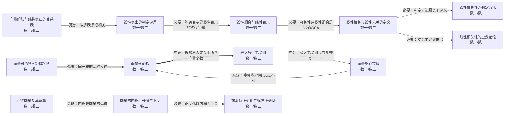

# 第三章 向量（向量组的线性相关性）

> 数一/数二/数三 均要求（数二只考具体坐标向量，不考抽象的向量空间证明）。核心：线性相关性的判定、极大无关组与向量组的秩。

## 知识点清单

| 知识点                     | 层次      | 一句话要点                                                                                |
| -------------------------- | --------- | ----------------------------------------------------------------------------------------- |
| [[n 维向量及其运算]]           | `数一` `数二` | n 个数组成的有序数组 α=(a₁,…,aₙ)ᵀ；加法与数乘按分量进行。                                 |
| [[向量的内积、长度与正交]]     | `数一` `数二` | 内积 (α,β)=αᵀβ；长度 ‖α‖=√(αᵀα)；αᵀβ=0 称正交；非零正交组线性无关。                       |
| [[线性组合与线性表示]]         | `数一` `数二` | β 可由 α₁,…,αₛ 线性表示 ⇔ 存在 k₁,…,kₛ 使 β=Σkᵢαᵢ ⇔ 方程组 Ax=β 有解。                    |
| [[线性相关与线性无关的定义]]   | `数一` `数二` | 存在不全为零的 kᵢ 使 Σkᵢαᵢ=0 则线性相关；只有全零解才成立则线性无关。                     |
| [[线性相关性的判定方法]]       | `数一` `数二` | 向量个数 s 与维数 n 比较：s>n 必相关；s=n 时看行列式；一般情形看 r(α₁…αₛ) 与 s 是否相等。 |
| [[线性相关性的重要结论]]       | `数一` `数二` | 部分相关 ⇒ 整体相关；整体无关 ⇒ 部分无关；无关组添加分量仍无关，相关组减少分量仍相关。    |
| [[向量组的等价]]               | `数一` `数二` | 两组可互相线性表示称等价；等价向量组的秩相等（逆不成立）。                                |
| [[极大线性无关组]]             | `数一` `数二` | 向量组中线性无关且再添任一向量就相关的部分组；不唯一，但所含向量个数固定。                |
| [[向量组的秩]]                 | `数一` `数二` | 向量组的极大线性无关组所含向量的个数，记 r(α₁,…,αₛ)。                                     |
| [[向量组的秩与矩阵的秩]]       | `数一` `数二` | 矩阵的秩 = 行向量组的秩 = 列向量组的秩；这是"行秩 = 列秩"的完整表述。                     |
| [[线性表出的判定定理]]         | `数一` `数二` | β 可由组 (I) 唯一表示 ⇔ r(I)=r(I,β)=s（组 (I) 无关）；有无穷多种表示则 r(I)=r(I,β)<s。    |
| [[向量组秩与线性表出的关系表]] | `数一` `数二` | 单向定理：若 (I) 可由 (II) 表示且 s > r(II)，则 (I) 必线性相关。                          |
| [[施密特正交化与标准正交基]]   | `数一` `数二` | 把线性无关组逐步化为正交组：β₁=α₁，βᵢ=αᵢ−Σ(αᵢ,βⱼ)/(βⱼ,βⱼ)·βⱼ，再单位化。                  |

## 本章关系图（Mermaid）

## 跨章连接（本章与外部的充分必要关系）

| 起点                       | 关系   | 终点                       | 含义                                 |
| -------------------------- | ------ | -------------------------- | ------------------------------------ |
| [[线性相关性的判定方法]]       | 🟧 充分 | [[｜A｜=0 ⇔ 行（列）线性相关]] | 方阵时判定归于 ｜A｜ 是否为 0        |
| [[线性相关性的判定方法]]       | 🟧 充分 | [[矩阵的秩]]                   | 一般情形判定归于秩与向量个数是否相等 |
| [[向量组的秩与矩阵的秩]]       | 🟥 充要 | [[矩阵的秩]]                   | 行秩＝列秩＝矩阵的秩                 |
| [[施密特正交化与标准正交基]]   | 🟧 充分 | [[实对称矩阵的正交对角化]]     | 正交化是正交对角化的必备步骤         |
| [[线性相关与线性无关的定义]]   | 🟥 充要 | [[可逆的充要条件（汇总枢纽）]] | 列组无关 ⇔ 矩阵可逆                  |
| [[同解方程组与公共解]]         | 🟥 充要 | [[向量组的等价]]               | 同解 ⇔ 行向量组可相互线性表示        |
| [[维数、基与坐标]]             | 🟩 关联 | [[向量组的秩]]                 | 维数是基所含向量个数                 |
| [[线性空间与子空间]]           | 🟧 充分 | [[向量的内积、长度与正交]]     | 内积空间是线性空间的加强             |
| [[可逆的充要条件（汇总枢纽）]] | 🟥 充要 | [[线性相关与线性无关的定义]]   | 可逆 ⇔ 列组线性无关                  |
| [[线性相关性的判定方法]]       | 🟧 充分 | [[特征值与特征向量的性质]]     | 不同特征值的特征向量线性无关         |
| [[向量组秩与线性表出的关系表]] | 🟧 充分 | [[代数重数与几何重数]]         | 以少表多必相关 ⇒ 几何重数受限        |

## Obsidian 双链版关系（供图谱 view 使用）

- [[线性相关性的判定方法]] ⇒ 🟧 充分 ⇒ [[｜A｜=0 ⇔ 行（列）线性相关]]——方阵时判定归于 ｜A｜ 是否为 0
- [[线性相关性的判定方法]] ⇒ 🟧 充分 ⇒ [[矩阵的秩]]——一般情形判定归于秩与向量个数是否相等
- [[向量组的秩与矩阵的秩]] ⇒ 🟥 充要 ⇒ [[矩阵的秩]]——行秩＝列秩＝矩阵的秩
- [[施密特正交化与标准正交基]] ⇒ 🟧 充分 ⇒ [[实对称矩阵的正交对角化]]——正交化是正交对角化的必备步骤
- [[线性相关与线性无关的定义]] ⇒ 🟥 充要 ⇒ [[可逆的充要条件（汇总枢纽）]]——列组无关 ⇔ 矩阵可逆
- [[同解方程组与公共解]] ⇒ 🟥 充要 ⇒ [[向量组的等价]]——同解 ⇔ 行向量组可相互线性表示
- [[维数、基与坐标]] ⇒ 🟩 关联 ⇒ [[向量组的秩]]——维数是基所含向量个数
- [[线性空间与子空间]] ⇒ 🟧 充分 ⇒ [[向量的内积、长度与正交]]——内积空间是线性空间的加强
- [[可逆的充要条件（汇总枢纽）]] ⇒ 🟥 充要 ⇒ [[线性相关与线性无关的定义]]——可逆 ⇔ 列组线性无关
- [[线性相关性的判定方法]] ⇒ 🟧 充分 ⇒ [[特征值与特征向量的性质]]——不同特征值的特征向量线性无关
- [[向量组秩与线性表出的关系表]] ⇒ 🟧 充分 ⇒ [[代数重数与几何重数]]——以少表多必相关 ⇒ 几何重数受限

---

返回：[[00 线性代数知识网总览]]
