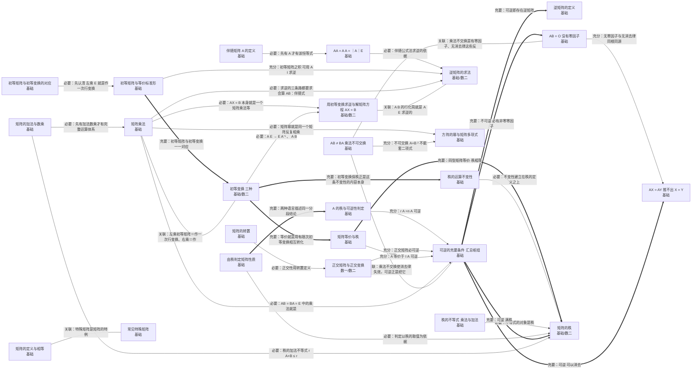

# 第二章 矩阵

> 基础/数一/数二 均要求。核心：矩阵乘法、逆矩阵与伴随矩阵、初等变换与秩，是线代全书的运算主干。

## 知识点清单

| 知识点                            | 层次      | 一句话要点                                                                                                                 |
| --------------------------------- | --------- | -------------------------------------------------------------------------------------------------------------------------- |
| [[矩阵的定义与相等]]                  | `基础`      | m×n 个数排成的数表 A=(aᵢⱼ)；同型且对应元素全相等才相等。                                                                   |
| [[常见特殊矩阵]]                      | `基础`      | 零矩阵、单位矩阵、对角矩阵、数量矩阵、三角矩阵、对称与反对称矩阵。                                                         |
| [[矩阵的加法与数乘]]                  | `基础`      | 同型矩阵对应元素相加；数 k 乘 A 即所有元素都乘 k。                                                                         |
| [[矩阵乘法]]                          | `基础`      | A_{m×s}B_{s×n} 才有意义，结果 C_{m×n}，cᵢⱼ = Σₖ aᵢₖbₖⱼ（左行乘右列）。                                                     |
| [[AB ≠ BA（乘法不可交换）]]           | `基础`      | 一般 AB ≠ BA；AB = BA 称为 A 与 B 可交换，是特殊情形。                                                                     |
| [[AB = O 没有零因子]]                 | `基础`      | AB = O 推不出 A = O 或 B = O。                                                                                             |
| [[AX = AY 推不出 X = Y]]              | `基础`      | 矩阵乘法不满足消去律：即使 AB = AC 也不能约去 A，除非 A 可逆。                                                             |
| [[矩阵的转置]]                        | `基础`      | (Aᵀ)ᵀ=A；(A+B)ᵀ=Aᵀ+Bᵀ；(kA)ᵀ=kAᵀ；(AB)ᵀ=BᵀAᵀ（要"反序"）。                                                                 |
| [[方阵的幂与矩阵多项式]]              | `基础`      | 求 Aᵏ 的常用办法：找规律、拆分 A = λE + B（B 幂零）、用秩 1 矩阵性质、用对角化。                                           |
| [[伴随矩阵 A∗ 的定义|伴随矩阵 A* 的定义]]                | `基础`      | A* = (Aⱼᵢ)，即把每个元素的代数余子式排成矩阵后再转置。                                                                     |
| [[AA∗ = A∗A = ｜A｜E|AA* = A*A = ｜A｜E]]                  | `基础`      | 伴随矩阵的核心恒等式：AA* = A*A = ｜A｜E。                                                                                   |
| [[A∗ 的秩与可逆性判定|A* 的秩与可逆性判定]]               | `基础`      | r(A*) = n（若 r(A)=n）；= 1（若 r(A)=n−1）；= 0（若 r(A)≤n−2）。                                                           |
| [[逆矩阵的定义]]                      | `基础`      | 存在 B 使 AB = BA = E，则 B = A⁻¹ 唯一；此时称 A 可逆（非奇异）。                                                          |
| [[可逆的充要条件（汇总枢纽）]]        | `基础`      | A 可逆 ⇔ ｜A｜≠0 ⇔ r(A)=n ⇔ Ax=0 只有零解 ⇔ A 的行（列）组线性无关 ⇔ 特征值全非零 ⇔ A 与 E 等价 ⇔ A 可表示为初等矩阵之积。 |
| [[逆矩阵的求法]]                      | `基础` `数二` | (A ｜ E) 经初等行变换化为 (E ｜ A⁻¹)；或用伴随公式 A⁻¹ = A*/｜A｜；或定义法（凑 AB = E）。                                 |
| [[用初等变换求逆与解矩阵方程 AX = B]] | `基础` `数二` | 对 (A ｜ E) 作行变换得 A⁻¹；对 (A｜B) 作行变换得 (E ｜ A⁻¹B)，即 X = A⁻¹B。                                                |
| [[分块矩阵及其运算]]                  | `基础` `数二` | 分块后按"小矩阵"整体做乘法、转置与求逆；分块对角阵的逆与原矩阵块的逆对应。                                                 |
| [[初等变换（三种）]]                  | `基础` `数二` | 换行、乘非零数、倍加。初等行变换不改变矩阵的秩（等价变换）。                                                               |
| [[初等矩阵与等价标准形]]              | `基础`      | 对 I 作一次初等变换得到初等矩阵 E；左乘 E 相当于作对应行变换，右乘相当于作列变换。                                         |
| [[初等矩阵与初等变换的对应]]          | `基础`      | ｜E｜ ≠ 0 且 ｜E(i,j)｜=−1、｜E(i(k))｜=k、｜E(ij(k))｜=1，是"初等矩阵行列式"的完整清单。                                  |
| [[矩阵等价与秩]]                      | `基础`      | A ≅ B ⇔ 存在可逆 P,Q 使 PAQ = B ⇔ r(A) = r(B)（同型）。                                                                    |
| [[矩阵的秩]]                          | `基础` `数二` | A 中非零子式的最高阶数；也等于行（列）向量组的秩，即行阶梯形非零行数。                                                     |
| [[秩的运算不变性]]                    | `基础`      | r(A)=r(Aᵀ)=r(kA)(k≠0)=r(AᵀA)=r(AAᵀ)；可逆 P,Q 使 r(PAQ)=r(A)。                                                             |
| [[秩的不等式（乘法与加法）]]          | `基础`      | r(A+B) ≤ r(A)+r(B)；r(AB) ≤ min{r(A),r(B)}；r(AB) ≥ r(A)+r(B)−n（A 为 m×n、B 为 n×s）。                                    |
| [[由秩判定矩阵性质]]                  | `基础`      | r(A)=0 ⇔ A=O；n 阶方阵 r(A)=n ⇔ 可逆；r(A)=n−1 ⇒ A*≠O 且 A*不可逆。                                                          |
| [[正交矩阵与正交变换]]                | `数一` `数二` | AᵀA = AAᵀ = E，即 A⁻¹ = Aᵀ；其列（行）组是标准正交基。                                                                     |
| [[矩阵的迹]]                          | `基础` `数二` | tr(A) = Σaᵢᵢ；tr(AB) = tr(BA)；tr(A) = Σλᵢ。                                                                               |

## 本章关系图（Mermaid）

## 跨章连接（本章与外部的充分必要关系）

| 起点                              | 关系   | 终点                       | 含义                                                                                              |
| --------------------------------- | ------ | -------------------------- | ------------------------------------------------------------------------------------------------- |
| [[｜A｜=0 ⇔ 行（列）线性相关]]        | 🟥 充要 | [[可逆的充要条件（汇总枢纽）]] | ｜A｜=0 与不可逆一一对应                                                                          |
| [[由行列式判定矩阵的秩]]              | 🟥 充要 | [[矩阵的秩]]                   | 子式判定与秩的定义同源                                                                            |
| [[由行列式判定矩阵的秩]]              | 🟥 充要 | [[可逆的充要条件（汇总枢纽）]] | 满秩 ⇔ 可逆                                                                                       |
| [[｜AB｜ = ｜A｜｜B｜]]               | 🟧 充分 | [[可逆的充要条件（汇总枢纽）]] | ｜A｜｜B｜≠0 ⇒ AB 可逆                                                                            |
| [[A∗ 的秩与可逆性判定|A* 的秩与可逆性判定]]               | 🟪 必要 | [[由行列式判定矩阵的秩]]       | 需借助行列式为零判定降秩                                                                          |
| [[矩阵的迹]]                          | 🟪 必要 | [[特征多项式与特征方程]]       | tr = Σλ 需特征值信息                                                                              |
| [[初等矩阵与初等变换的对应]]          | 🟪 必要 | [[｜AB｜ = ｜A｜｜B｜]]        | 由 ｜AB｜=｜A｜｜B｜ 推出变换对行列式的影响                                                       |
| [[分块矩阵及其运算]]                  | 🟪 必要 | [[分块（拉普拉斯）行列式]]     | 分块行列式以分块矩阵为对象                                                                        |
| [[初等变换（三种）]]                  | 🟧 充分 | [[高斯消元法与行阶梯形]]       | 初等行变换是消元法的操作                                                                          |
| [[线性相关性的判定方法]]              | 🟧 充分 | [[矩阵的秩]]                   | 一般情形判定归于秩与向量个数是否相等                                                              |
| [[向量组的秩与矩阵的秩]]              | 🟥 充要 | [[矩阵的秩]]                   | 行秩＝列秩＝矩阵的秩                                                                              |
| [[线性相关与线性无关的定义]]          | 🟥 充要 | [[可逆的充要条件（汇总枢纽）]] | 列组无关 ⇔ 矩阵可逆                                                                               |
| [[非齐次方程组的通解结构]]            | 🟪 必要 | [[逆矩阵的求法]]               | 矩阵方程求解常用逆矩阵                                                                            |
| [[高斯消元法与行阶梯形]]              | 🟧 充分 | [[A∗ 的秩与可逆性判定|A* 的秩与可逆性判定]]        | 解方程组可求伴随矩阵的秩                                                                          |
| [[特征值的运算性质]]                  | 🟧 充分 | [[A∗ 的秩与可逆性判定|A* 的秩与可逆性判定]]        | A* 的特征值 ｜A｜/λ 可反推可逆性                                                                  |
| [[特征值的运算性质]]                  | 🟪 必要 | [[矩阵的迹]]                   | tr＝Σλ 是性质的一部分                                                                             |
| [[相似的判定与反例]]                  | 🟧 充分 | [[矩阵的迹]]                   | 迹不同即可判不相似                                                                                |
| [[特征值与特征向量的定义]]            | 🟥 充要 | [[可逆的充要条件（汇总枢纽）]] | A 可逆 ⇔ 特征值全非零                                                                             |
| [[矩阵合同]]                          | 🟧 充分 | [[正交矩阵与正交变换]]         | 取 C 为正交矩阵时 CᵀAC＝C⁻¹AC，同一个变换同时实现合同与相似（逆向不成立）                         |
| [[半正定与负定矩阵]]                  | 🟧 充分 | [[矩阵的秩]]                   | 半正定时 r(A) 等于正特征值个数                                                                    |
| [[惯性指数与符号差]]                  | 🟧 充分 | [[矩阵的秩]]                   | 正负惯性指数之和 p+q 就是二次型的秩 r(A)：会算惯性指数就能读出秩（反之不成立）                    |
| [[二次型及其矩阵表示]]                | 🟧 充分 | [[常见特殊矩阵]]               | 二次型矩阵必为对称矩阵                                                                            |
| [[合同与相似的对比]]                  | 🟧 充分 | [[矩阵等价与秩]]               | 合同与相似都强于等价                                                                              |
| [[可逆的充要条件（汇总枢纽）]]        | 🟧 充分 | [[可对角化的充要条件]]         | 可逆 + 可对角化 ⇒ 对角元非零                                                                      |
| [[可逆的充要条件（汇总枢纽）]]        | 🟥 充要 | [[齐次方程组 Ax = 0]]          | 可逆 ⇔ 齐次只有零解                                                                               |
| [[可逆的充要条件（汇总枢纽）]]        | 🟥 充要 | [[线性相关与线性无关的定义]]   | 可逆 ⇔ 列组线性无关                                                                               |
| [[可逆的充要条件（汇总枢纽）]]        | 🟥 充要 | [[｜A｜=0 ⇔ 行（列）线性相关]] | 可逆 ⇔ ｜A｜≠0                                                                                    |
| [[矩阵的秩]]                          | 🟪 必要 | [[系数矩阵与增广矩阵的关系]]   | 相容性判别以秩为语言                                                                              |
| [[秩的不等式（乘法与加法）]]          | 🟧 充分 | [[矩阵方程 AX = O 与 AB = O]]  | 乘法秩不等式 r(AB) ≥ r(A)+r(B)−n 中令 r(AB)=0，即得 AB=O 时的 r(A)+r(B) ≤ n（特例，反过来不成立） |
| [[矩阵的迹]]                          | 🟧 充分 | [[特征值的应用：求行列式与幂]] | tr＝Σλ 提供反解参数的另一方程                                                                     |
| [[方阵的幂与矩阵多项式]]              | 🟩 关联 | [[用对角化求 Aᵏ 与矩阵函数]]   | 同一个"求 Aᵏ"主题的两种手段：初等技巧（拆分/秩 1）与对角化                                        |
| [[方阵的幂与矩阵多项式]]              | 🟩 关联 | [[相似对角化的方法与步骤]]     | 求 Aᵏ 的两条主线之一：对角化 A = PΛP⁻¹ ⇒ Aᵏ = PΛᵏP⁻¹                                              |
| [[方阵的幂与矩阵多项式]]              | 🟩 关联 | [[特征值的应用：求行列式与幂]] | 秩 1 矩阵的幂公式 Aᵏ = (trA)^{k−1}A 要用迹，与"用特征值求幂"同属一套应用                          |
| [[用初等变换求逆与解矩阵方程 AX = B]] | 🟧 充分 | [[矩阵方程 AX = O 与 AB = O]]  | 把 B 换成 O 即得齐次矩阵方程 AX = O，解法与 AX = B 完全同形                                       |
| [[正定二次型与正定矩阵]]              | 🟧 充分 | [[正交矩阵与正交变换]]         | 正定矩阵与 E 合同，而 E 本身正交；正定矩阵又是实对称的，必可正交对角化（反之不成立）              |

## Obsidian 双链版关系（供图谱 view 使用）

- [[｜A｜=0 ⇔ 行（列）线性相关]] ⇒ 🟥 充要 ⇒ [[可逆的充要条件（汇总枢纽）]]——｜A｜=0 与不可逆一一对应
- [[由行列式判定矩阵的秩]] ⇒ 🟥 充要 ⇒ [[矩阵的秩]]——子式判定与秩的定义同源
- [[由行列式判定矩阵的秩]] ⇒ 🟥 充要 ⇒ [[可逆的充要条件（汇总枢纽）]]——满秩 ⇔ 可逆
- [[｜AB｜ = ｜A｜｜B｜]] ⇒ 🟧 充分 ⇒ [[可逆的充要条件（汇总枢纽）]]——｜A｜｜B｜≠0 ⇒ AB 可逆
- [[A∗ 的秩与可逆性判定|A* 的秩与可逆性判定]] ⇒ 🟪 必要 ⇒ [[由行列式判定矩阵的秩]]——需借助行列式为零判定降秩
- [[矩阵的迹]] ⇒ 🟪 必要 ⇒ [[特征多项式与特征方程]]——tr = Σλ 需特征值信息
- [[初等矩阵与初等变换的对应]] ⇒ 🟪 必要 ⇒ [[｜AB｜ = ｜A｜｜B｜]]——由 ｜AB｜=｜A｜｜B｜ 推出变换对行列式的影响
- [[分块矩阵及其运算]] ⇒ 🟪 必要 ⇒ [[分块（拉普拉斯）行列式]]——分块行列式以分块矩阵为对象
- [[初等变换（三种）]] ⇒ 🟧 充分 ⇒ [[高斯消元法与行阶梯形]]——初等行变换是消元法的操作
- [[线性相关性的判定方法]] ⇒ 🟧 充分 ⇒ [[矩阵的秩]]——一般情形判定归于秩与向量个数是否相等
- [[向量组的秩与矩阵的秩]] ⇒ 🟥 充要 ⇒ [[矩阵的秩]]——行秩＝列秩＝矩阵的秩
- [[线性相关与线性无关的定义]] ⇒ 🟥 充要 ⇒ [[可逆的充要条件（汇总枢纽）]]——列组无关 ⇔ 矩阵可逆
- [[非齐次方程组的通解结构]] ⇒ 🟪 必要 ⇒ [[逆矩阵的求法]]——矩阵方程求解常用逆矩阵
- [[高斯消元法与行阶梯形]] ⇒ 🟧 充分 ⇒ [[A∗ 的秩与可逆性判定|A* 的秩与可逆性判定]]——解方程组可求伴随矩阵的秩
- [[特征值的运算性质]] ⇒ 🟧 充分 ⇒ [[A∗ 的秩与可逆性判定|A* 的秩与可逆性判定]]——A* 的特征值 ｜A｜/λ 可反推可逆性
- [[特征值的运算性质]] ⇒ 🟪 必要 ⇒ [[矩阵的迹]]——tr＝Σλ 是性质的一部分
- [[相似的判定与反例]] ⇒ 🟧 充分 ⇒ [[矩阵的迹]]——迹不同即可判不相似
- [[特征值与特征向量的定义]] ⇒ 🟥 充要 ⇒ [[可逆的充要条件（汇总枢纽）]]——A 可逆 ⇔ 特征值全非零
- [[矩阵合同]] ⇒ 🟧 充分 ⇒ [[正交矩阵与正交变换]]——取 C 为正交矩阵时 CᵀAC＝C⁻¹AC，同一个变换同时实现合同与相似（逆向不成立）
- [[半正定与负定矩阵]] ⇒ 🟧 充分 ⇒ [[矩阵的秩]]——半正定时 r(A) 等于正特征值个数
- [[惯性指数与符号差]] ⇒ 🟧 充分 ⇒ [[矩阵的秩]]——正负惯性指数之和 p+q 就是二次型的秩 r(A)：会算惯性指数就能读出秩（反之不成立）
- [[二次型及其矩阵表示]] ⇒ 🟧 充分 ⇒ [[常见特殊矩阵]]——二次型矩阵必为对称矩阵
- [[合同与相似的对比]] ⇒ 🟧 充分 ⇒ [[矩阵等价与秩]]——合同与相似都强于等价
- [[可逆的充要条件（汇总枢纽）]] ⇒ 🟧 充分 ⇒ [[可对角化的充要条件]]——可逆 + 可对角化 ⇒ 对角元非零
- [[可逆的充要条件（汇总枢纽）]] ⇒ 🟥 充要 ⇒ [[齐次方程组 Ax = 0]]——可逆 ⇔ 齐次只有零解
- [[可逆的充要条件（汇总枢纽）]] ⇒ 🟥 充要 ⇒ [[线性相关与线性无关的定义]]——可逆 ⇔ 列组线性无关
- [[可逆的充要条件（汇总枢纽）]] ⇒ 🟥 充要 ⇒ [[｜A｜=0 ⇔ 行（列）线性相关]]——可逆 ⇔ ｜A｜≠0
- [[矩阵的秩]] ⇒ 🟪 必要 ⇒ [[系数矩阵与增广矩阵的关系]]——相容性判别以秩为语言
- [[秩的不等式（乘法与加法）]] ⇒ 🟧 充分 ⇒ [[矩阵方程 AX = O 与 AB = O]]——乘法秩不等式 r(AB) ≥ r(A)+r(B)−n 中令 r(AB)=0，即得 AB=O 时的 r(A)+r(B) ≤ n（特例，反过来不成立）
- [[矩阵的迹]] ⇒ 🟧 充分 ⇒ [[特征值的应用：求行列式与幂]]——tr＝Σλ 提供反解参数的另一方程
- [[方阵的幂与矩阵多项式]] ⇒ 🟩 关联 ⇒ [[用对角化求 Aᵏ 与矩阵函数]]——同一个"求 Aᵏ"主题的两种手段：初等技巧（拆分/秩 1）与对角化
- [[方阵的幂与矩阵多项式]] ⇒ 🟩 关联 ⇒ [[相似对角化的方法与步骤]]——求 Aᵏ 的两条主线之一：对角化 A = PΛP⁻¹ ⇒ Aᵏ = PΛᵏP⁻¹
- [[方阵的幂与矩阵多项式]] ⇒ 🟩 关联 ⇒ [[特征值的应用：求行列式与幂]]——秩 1 矩阵的幂公式 Aᵏ = (trA)^{k−1}A 要用迹，与"用特征值求幂"同属一套应用
- [[用初等变换求逆与解矩阵方程 AX = B]] ⇒ 🟧 充分 ⇒ [[矩阵方程 AX = O 与 AB = O]]——把 B 换成 O 即得齐次矩阵方程 AX = O，解法与 AX = B 完全同形
- [[正定二次型与正定矩阵]] ⇒ 🟧 充分 ⇒ [[正交矩阵与正交变换]]——正定矩阵与 E 合同，而 E 本身正交；正定矩阵又是实对称的，必可正交对角化（反之不成立）

---

返回：[[00 线性代数知识网总览]]
