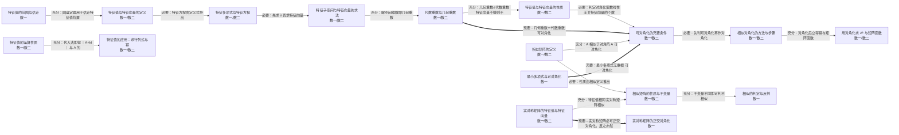

# 第五章 矩阵的特征值与特征向量

> 数一/数二/数三 均要求，且是数二的绝对重点（数二特征值板块可占线代分值的 40% 以上）。核心：特征值的计算、相似对角化与实对称矩阵的正交对角化。

## 知识点清单

| 知识点 | 层次 | 一句话要点 |
| --- | --- | --- |
| [[特征值与特征向量的定义]] | `数一` `数二` | Aα = λα（α≠0），λ 为特征值、α 为对应特征向量。 |
| [[特征多项式与特征方程]] | `数一` `数二` | ｜λE − A｜ 为特征多项式，｜λE−A｜=0 为特征方程，其根即全部特征值（含重数）。 |
| [[特征子空间与特征向量的求法]] | `数一` `数二` | 对每个 λᵢ 解齐次方程组 (λᵢI−A)x=0，其基础解系即属于 λᵢ 的线性无关特征向量。 |
| [[代数重数与几何重数]] | `数一` `数二` | 代数重数 nᵢ 为 λᵢ 作为特征方程根的重数；几何重数 mᵢ = n − r(λᵢI−A)；恒有 1 ≤ mᵢ ≤ nᵢ。 |
| [[特征值与特征向量的性质]] | `数一` `数二` | 属于不同特征值的特征向量线性无关；k 重特征值最多有 k 个线性无关的特征向量。 |
| [[特征值的运算性质]] | `数一` `数二` | f(A) 的特征值为 f(λ)；A⁻¹ 为 1/λ；A* 为 ｜A｜/λ；Aᵀ 与 A 特征值相同（特征向量一般不同）。 |
| [[相似矩阵的定义]] | `数一` `数二` | 存在可逆 P 使 P⁻¹AP = B，则 A ∼ B；相似是等价关系（自反、对称、传递）。 |
| [[相似矩阵的性质与不变量]] | `数一` `数二` | 相似矩阵有相同的特征多项式、特征值、行列式、迹、秩；且 P⁻¹AᵏP=(P⁻¹AP)ᵏ，P⁻¹A*P=(P⁻¹AP)*。 |
| [[相似的判定与反例]] | `数一` | 特征值相同不一定相似（如 diag(1,1) 与 [​[1,1],[0,1]]）；可用"是否可对角化"或"r(λE−A) 是否相同"区分。 |
| [[可对角化的充要条件]] | `数一` `数二` | A 可对角化 ⇔ A 有 n 个线性无关的特征向量 ⇔ 每个特征值的几何重数 = 代数重数 ⇔ Σmᵢ = n。 |
| [[相似对角化的方法与步骤]] | `数一` `数二` | 求特征值 → 求各自的特征向量 → 拼成 P=(α₁,…,αₙ) → 得 P⁻¹AP = Λ = diag(λ₁,…,λₙ)。 |
| [[用对角化求 Aᵏ 与矩阵函数]] | `数一` `数二` | A = PΛP⁻¹ ⇒ Aᵏ = PΛᵏP⁻¹；同理可得 f(A) = Pf(Λ)P⁻¹。 |
| [[实对称矩阵的特征值与特征向量]] | `数一` `数二` | 实对称矩阵的特征值全为实数；不同特征值对应的特征向量相互正交。 |
| [[实对称矩阵的正交对角化]] | `数一` | 必存在正交矩阵 Q 使 QᵀAQ = Q⁻¹AQ = Λ（对角）。 |
| [[特征值的应用：求行列式与幂]] | `数一` `数二` | ｜A｜ = ∏λᵢ，tr(A) = Σλᵢ；配合相似不变量可反解参数。 |
| [[最小多项式与可对角化]] | `数一` | A 可对角化 ⇔ 最小多项式无重根 ⇔ (λE−A) 的每个重根的几何重数等于代数重数。 |
| [[特征值的范围与估计]] | `数一` | 圆盘定理：每个特征值都落在某个以 aᵢᵢ 为心、以该行非对角元绝对值之和为半径的圆盘内。 |

## 本章关系图（Mermaid）

## 跨章连接（本章与外部的充分必要关系）

| 起点 | 关系 | 终点 | 含义 |
| --- | --- | --- | --- |
| [[矩阵的迹]] | 🟪 必要 | [[特征多项式与特征方程]] | tr = Σλ 需特征值信息 |
| [[施密特正交化与标准正交基]] | 🟧 充分 | [[实对称矩阵的正交对角化]] | 正交化是正交对角化的必备步骤 |
| [[特征子空间与特征向量的求法]] | 🟧 充分 | [[齐次方程组的通解与解空间]] | 特征向量就是齐次方程组的非零解 |
| [[特征值的运算性质]] | 🟧 充分 | [[A∗ 的秩与可逆性判定|A* 的秩与可逆性判定]] | A* 的特征值 ｜A｜/λ 可反推可逆性 |
| [[特征值的运算性质]] | 🟪 必要 | [[矩阵的迹]] | tr＝Σλ 是性质的一部分 |
| [[实对称矩阵的正交对角化]] | 🟩 关联 | [[正交变换法化标准形]] | 正交对角化 QᵀAQ＝Λ 正是正交变换法化标准形的内核：同一件事的两种说法 |
| [[相似对角化的方法与步骤]] | 🟩 关联 | [[线性变换与矩阵的对应（相似）]] | 对角化是换基观点的特例 |
| [[相似的判定与反例]] | 🟧 充分 | [[矩阵的迹]] | 迹不同即可判不相似 |
| [[特征值与特征向量的定义]] | 🟥 充要 | [[可逆的充要条件（汇总枢纽）]] | A 可逆 ⇔ 特征值全非零 |
| [[二次型及其矩阵表示]] | 🟪 必要 | [[特征值与特征向量的定义]] | 二次型的矩阵是实对称矩阵，其性质依赖特征值 |
| [[正交变换法化标准形]] | 🟩 关联 | [[实对称矩阵的正交对角化]] | 正交变换法就是正交对角化的算法外壳：f＝xᵀAx 令 x＝Qy 即得 QᵀAQ＝Λ，标准形系数就是特征值 |
| [[矩阵合同]] | ⬜ 无关 | [[相似矩阵的定义]] | 合同（CᵀAC）与相似（P⁻¹AP）互不充分 |
| [[合同与相似的对比]] | 🟪 必要 | [[相似矩阵的定义]] | 对比以相似为另一方 |
| [[正定的充要条件（五条等价）]] | 🟥 充要 | [[实对称矩阵的特征值与特征向量]] | 正定 ⇔ 特征值全为正 |
| [[线性变换与矩阵的对应（相似）]] | 🟥 充要 | [[相似矩阵的定义]] | 相似即同一变换在不同基下的矩阵 |
| [[可逆的充要条件（汇总枢纽）]] | 🟧 充分 | [[可对角化的充要条件]] | 可逆 + 可对角化 ⇒ 对角元非零 |
| [[n 阶行列式]] | 🟧 充分 | [[特征多项式与特征方程]] | 特征多项式是行列式 |
| [[｜AB｜ = ｜A｜｜B｜]] | 🟧 充分 | [[特征值的应用：求行列式与幂]] | ｜A｜＝∏λ 由乘积公式与相似不变性得到 |
| [[矩阵的迹]] | 🟧 充分 | [[特征值的应用：求行列式与幂]] | tr＝Σλ 提供反解参数的另一方程 |
| [[线性相关性的判定方法]] | 🟧 充分 | [[特征值与特征向量的性质]] | 不同特征值的特征向量线性无关 |
| [[向量组秩与线性表出的关系表]] | 🟧 充分 | [[代数重数与几何重数]] | 以少表多必相关 ⇒ 几何重数受限 |
| [[方阵的幂与矩阵多项式]] | 🟩 关联 | [[用对角化求 Aᵏ 与矩阵函数]] | 同一个"求 Aᵏ"主题的两种手段：初等技巧（拆分/秩 1）与对角化 |
| [[方阵的幂与矩阵多项式]] | 🟩 关联 | [[相似对角化的方法与步骤]] | 求 Aᵏ 的两条主线之一：对角化 A = PΛP⁻¹ ⇒ Aᵏ = PΛᵏP⁻¹ |
| [[方阵的幂与矩阵多项式]] | 🟩 关联 | [[特征值的应用：求行列式与幂]] | 秩 1 矩阵的幂公式 Aᵏ = (trA)^{k−1}A 要用迹，与"用特征值求幂"同属一套应用 |

## Obsidian 双链版关系（供图谱 view 使用）

- [[矩阵的迹]] ⇒ 🟪 必要 ⇒ [[特征多项式与特征方程]]——tr = Σλ 需特征值信息
- [[施密特正交化与标准正交基]] ⇒ 🟧 充分 ⇒ [[实对称矩阵的正交对角化]]——正交化是正交对角化的必备步骤
- [[特征子空间与特征向量的求法]] ⇒ 🟧 充分 ⇒ [[齐次方程组的通解与解空间]]——特征向量就是齐次方程组的非零解
- [[特征值的运算性质]] ⇒ 🟧 充分 ⇒ [[A∗ 的秩与可逆性判定|A* 的秩与可逆性判定]]——A* 的特征值 ｜A｜/λ 可反推可逆性
- [[特征值的运算性质]] ⇒ 🟪 必要 ⇒ [[矩阵的迹]]——tr＝Σλ 是性质的一部分
- [[实对称矩阵的正交对角化]] ⇒ 🟩 关联 ⇒ [[正交变换法化标准形]]——正交对角化 QᵀAQ＝Λ 正是正交变换法化标准形的内核：同一件事的两种说法
- [[相似对角化的方法与步骤]] ⇒ 🟩 关联 ⇒ [[线性变换与矩阵的对应（相似）]]——对角化是换基观点的特例
- [[相似的判定与反例]] ⇒ 🟧 充分 ⇒ [[矩阵的迹]]——迹不同即可判不相似
- [[特征值与特征向量的定义]] ⇒ 🟥 充要 ⇒ [[可逆的充要条件（汇总枢纽）]]——A 可逆 ⇔ 特征值全非零
- [[二次型及其矩阵表示]] ⇒ 🟪 必要 ⇒ [[特征值与特征向量的定义]]——二次型的矩阵是实对称矩阵，其性质依赖特征值
- [[正交变换法化标准形]] ⇒ 🟩 关联 ⇒ [[实对称矩阵的正交对角化]]——正交变换法就是正交对角化的算法外壳：f＝xᵀAx 令 x＝Qy 即得 QᵀAQ＝Λ，标准形系数就是特征值
- [[矩阵合同]] ⇒ ⬜ 无关 ⇒ [[相似矩阵的定义]]——合同（CᵀAC）与相似（P⁻¹AP）互不充分
- [[合同与相似的对比]] ⇒ 🟪 必要 ⇒ [[相似矩阵的定义]]——对比以相似为另一方
- [[正定的充要条件（五条等价）]] ⇒ 🟥 充要 ⇒ [[实对称矩阵的特征值与特征向量]]——正定 ⇔ 特征值全为正
- [[线性变换与矩阵的对应（相似）]] ⇒ 🟥 充要 ⇒ [[相似矩阵的定义]]——相似即同一变换在不同基下的矩阵
- [[可逆的充要条件（汇总枢纽）]] ⇒ 🟧 充分 ⇒ [[可对角化的充要条件]]——可逆 + 可对角化 ⇒ 对角元非零
- [[n 阶行列式]] ⇒ 🟧 充分 ⇒ [[特征多项式与特征方程]]——特征多项式是行列式
- [[｜AB｜ = ｜A｜｜B｜]] ⇒ 🟧 充分 ⇒ [[特征值的应用：求行列式与幂]]——｜A｜＝∏λ 由乘积公式与相似不变性得到
- [[矩阵的迹]] ⇒ 🟧 充分 ⇒ [[特征值的应用：求行列式与幂]]——tr＝Σλ 提供反解参数的另一方程
- [[线性相关性的判定方法]] ⇒ 🟧 充分 ⇒ [[特征值与特征向量的性质]]——不同特征值的特征向量线性无关
- [[向量组秩与线性表出的关系表]] ⇒ 🟧 充分 ⇒ [[代数重数与几何重数]]——以少表多必相关 ⇒ 几何重数受限
- [[方阵的幂与矩阵多项式]] ⇒ 🟩 关联 ⇒ [[用对角化求 Aᵏ 与矩阵函数]]——同一个"求 Aᵏ"主题的两种手段：初等技巧（拆分/秩 1）与对角化
- [[方阵的幂与矩阵多项式]] ⇒ 🟩 关联 ⇒ [[相似对角化的方法与步骤]]——求 Aᵏ 的两条主线之一：对角化 A = PΛP⁻¹ ⇒ Aᵏ = PΛᵏP⁻¹
- [[方阵的幂与矩阵多项式]] ⇒ 🟩 关联 ⇒ [[特征值的应用：求行列式与幂]]——秩 1 矩阵的幂公式 Aᵏ = (trA)^{k−1}A 要用迹，与"用特征值求幂"同属一套应用

---

返回：[[00 线性代数知识网总览]]
