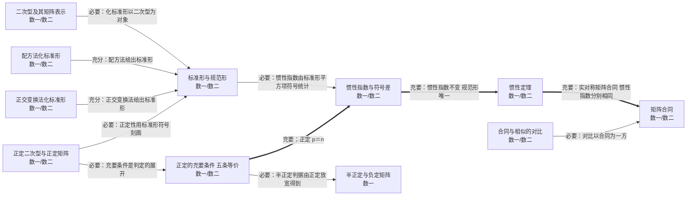

# 第六章 二次型

> 数一/数二/数三 全章要求：二次型的矩阵表示、秩、合同与惯性定理，以及用正交变换法/配方法化标准形、正定性判定。

## 知识点清单

| 知识点                     | 层次      | 一句话要点                                                                                              |
| -------------------------- | --------- | ------------------------------------------------------------------------------------------------------- |
| [[二次型及其矩阵表示]]         | `数一` `数二` | n 元二次齐次多项式 f = xᵀAx，其中 A 为实对称矩阵（aᵢⱼ=aⱼᵢ=交叉项系数的一半）。                          |
| [[标准形与规范形]]             | `数一` `数二` | 标准形：只含平方项 d₁y₁²+…+dₙyₙ²；规范形：系数只取 1、−1、0。                                           |
| [[惯性指数与符号差]]           | `数一` `数二` | 正惯性指数 p（正平方项个数）、负惯性指数 q（负平方项个数）、符号差 p − q；p + q = r(f)。                |
| [[配方法化标准形]]             | `数一` `数二` | 按变量逐个配成完全平方，得到可逆线性替换 x = Cy，从而 f = d₁y₁²+…。                                     |
| [[正交变换法化标准形]]         | `数一` `数二` | A 正交对角化：取正交矩阵 Q，令 x = Qy，则 f = λ₁y₁²+…+λₙyₙ²（λ 为特征值）。                             |
| [[惯性定理]]                   | `数一` `数二` | 二次型经任意可逆线性替换，正、负惯性指数不变，因而规范形唯一。                                          |
| [[矩阵合同]]                   | `数一` `数二` | 存在可逆 C 使 CᵀAC = B，则 A ≃ B（合同）；实对称矩阵合同 ⇔ 正负惯性指数分别相同。                       |
| [[合同与相似的对比]]           | `数一` `数二` | 相似：P⁻¹AP 保特征值；合同：CᵀAC 保惯性指数；正交相似时二者等价。                                       |
| [[正定二次型与正定矩阵]]       | `数一` `数二` | 对任意 x≠0 有 xᵀAx > 0，则 A 正定，记 A > 0。                                                           |
| [[正定的充要条件（五条等价）]] | `数一` `数二` | A 正定 ⇔ 特征值全正 ⇔ 正惯性指数 p = n ⇔ 存在可逆 C 使 A = CᵀC ⇔ 各阶顺序主子式全大于零 ⇔ A 与 E 合同。 |
| [[半正定与负定矩阵]]           | `数一`      | 半正定：xᵀAx ≥ 0 ⇔ 特征值全 ≥0 ⇔ 所有主子式 ≥0；负定：−A 正定。                                         |

## 本章关系图（Mermaid）

## 跨章连接（本章与外部的充分必要关系）

| 起点                         | 关系   | 终点                         | 含义                                                                                    |
| ---------------------------- | ------ | ---------------------------- | --------------------------------------------------------------------------------------- |
| [[实对称矩阵的正交对角化]]       | 🟩 关联 | [[正交变换法化标准形]]           | 正交对角化 QᵀAQ＝Λ 正是正交变换法化标准形的内核：同一件事的两种说法                     |
| [[二次型及其矩阵表示]]           | 🟪 必要 | [[特征值与特征向量的定义]]       | 二次型的矩阵是实对称矩阵，其性质依赖特征值                                              |
| [[正交变换法化标准形]]           | 🟩 关联 | [[实对称矩阵的正交对角化]]       | 正交变换法就是正交对角化的算法外壳：f＝xᵀAx 令 x＝Qy 即得 QᵀAQ＝Λ，标准形系数就是特征值 |
| [[矩阵合同]]                     | ⬜ 无关 | [[相似矩阵的定义]]               | 合同（CᵀAC）与相似（P⁻¹AP）互不充分                                                     |
| [[合同与相似的对比]]             | 🟪 必要 | [[相似矩阵的定义]]               | 对比以相似为另一方                                                                      |
| [[矩阵合同]]                     | 🟧 充分 | [[正交矩阵与正交变换]]           | 取 C 为正交矩阵时 CᵀAC＝C⁻¹AC，同一个变换同时实现合同与相似（逆向不成立）               |
| [[正定的充要条件（五条等价）]]   | 🟥 充要 | [[实对称矩阵的特征值与特征向量]] | 正定 ⇔ 特征值全为正                                                                     |
| [[半正定与负定矩阵]]             | 🟧 充分 | [[矩阵的秩]]                     | 半正定时 r(A) 等于正特征值个数                                                          |
| [[惯性指数与符号差]]             | 🟧 充分 | [[矩阵的秩]]                     | 正负惯性指数之和 p+q 就是二次型的秩 r(A)：会算惯性指数就能读出秩（反之不成立）          |
| [[二次型及其矩阵表示]]           | 🟧 充分 | [[常见特殊矩阵]]                 | 二次型矩阵必为对称矩阵                                                                  |
| [[合同与相似的对比]]             | 🟧 充分 | [[矩阵等价与秩]]                 | 合同与相似都强于等价                                                                    |
| [[线性变换与矩阵的对应（相似）]] | 🟧 充分 | [[矩阵合同]]                     | 同一变换 + 正交基 ⇒ 正交合同                                                            |
| [[正定二次型与正定矩阵]]         | 🟧 充分 | [[正交矩阵与正交变换]]           | 正定矩阵与 E 合同，而 E 本身正交；正定矩阵又是实对称的，必可正交对角化（反之不成立）    |

## Obsidian 双链版关系（供图谱 view 使用）

- [[实对称矩阵的正交对角化]] ⇒ 🟩 关联 ⇒ [[正交变换法化标准形]]——正交对角化 QᵀAQ＝Λ 正是正交变换法化标准形的内核：同一件事的两种说法
- [[二次型及其矩阵表示]] ⇒ 🟪 必要 ⇒ [[特征值与特征向量的定义]]——二次型的矩阵是实对称矩阵，其性质依赖特征值
- [[正交变换法化标准形]] ⇒ 🟩 关联 ⇒ [[实对称矩阵的正交对角化]]——正交变换法就是正交对角化的算法外壳：f＝xᵀAx 令 x＝Qy 即得 QᵀAQ＝Λ，标准形系数就是特征值
- [[矩阵合同]] ⇒ ⬜ 无关 ⇒ [[相似矩阵的定义]]——合同（CᵀAC）与相似（P⁻¹AP）互不充分
- [[合同与相似的对比]] ⇒ 🟪 必要 ⇒ [[相似矩阵的定义]]——对比以相似为另一方
- [[矩阵合同]] ⇒ 🟧 充分 ⇒ [[正交矩阵与正交变换]]——取 C 为正交矩阵时 CᵀAC＝C⁻¹AC，同一个变换同时实现合同与相似（逆向不成立）
- [[正定的充要条件（五条等价）]] ⇒ 🟥 充要 ⇒ [[实对称矩阵的特征值与特征向量]]——正定 ⇔ 特征值全为正
- [[半正定与负定矩阵]] ⇒ 🟧 充分 ⇒ [[矩阵的秩]]——半正定时 r(A) 等于正特征值个数
- [[惯性指数与符号差]] ⇒ 🟧 充分 ⇒ [[矩阵的秩]]——正负惯性指数之和 p+q 就是二次型的秩 r(A)：会算惯性指数就能读出秩（反之不成立）
- [[二次型及其矩阵表示]] ⇒ 🟧 充分 ⇒ [[常见特殊矩阵]]——二次型矩阵必为对称矩阵
- [[合同与相似的对比]] ⇒ 🟧 充分 ⇒ [[矩阵等价与秩]]——合同与相似都强于等价
- [[线性变换与矩阵的对应（相似）]] ⇒ 🟧 充分 ⇒ [[矩阵合同]]——同一变换 + 正交基 ⇒ 正交合同
- [[正定二次型与正定矩阵]] ⇒ 🟧 充分 ⇒ [[正交矩阵与正交变换]]——正定矩阵与 E 合同，而 E 本身正交；正定矩阵又是实对称的，必可正交对角化（反之不成立）

---

返回：[[00 线性代数知识网总览]]
