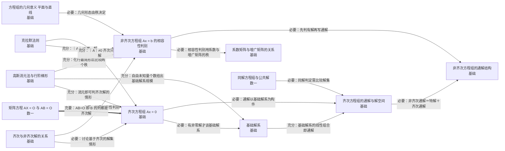

# 第四章 线性方程组

> 基础/数一/数二 均要求（数二核心考点）。核心：解的存在性判别、基础解系与通解结构。

## 知识点清单

| 知识点                           | 层次 | 一句话要点                                                                                     |
| -------------------------------- | ---- | ---------------------------------------------------------------------------------------------- |
| [[齐次方程组 Ax = 0]]                | `基础` | 必有零解；有非零解 ⇔ r(A) < n ⇔ 列组线性相关 ⇔ ｜A｜=0（方阵）。                               |
| [[基础解系]]                         | `基础` | Ax=0 的解向量组的极大无关组；当 r(A)=r<n 时含 n−r 个向量 ξ₁,…,ξ_{n−r}。                        |
| [[齐次方程组的通解与解空间]]         | `基础` | x = k₁ξ₁ + … + k_{n−r}ξ_{n−r}（kᵢ 任意）；所有解构成 n−r 维子空间（解空间）。                  |
| [[非齐次方程组 Ax = b 的相容性判别]] | `基础` | 有解 ⇔ r(A) = r(A,b)；无解 ⇔ r(A) < r(A,b)（此时 r(A)+1 = r(A,b)）。                           |
| [[非齐次方程组的通解结构]]           | `基础` | 通解 = 特解 η* + 对应齐次方程组的通解；任意两解之差是对应齐次的解。                            |
| [[系数矩阵与增广矩阵的关系]]         | `基础` | r(A) ≤ r(A,b) ≤ r(A)+1；两者相等 ⇔ 有解，相差 1 ⇔ 无解。                                       |
| [[克拉默法则]]                       | `基础` | n 个方程 n 个未知数且 ｜A｜≠0 时，xⱼ = ｜Aⱼ｜/｜A｜（Aⱼ 为第 j 列换成 b）。                    |
| [[齐次与非齐次解的关系]]             | `基础` | Ax=0 只有零解 ⇒ Ax=b 解唯一（若有解）；Ax=0 有非零解 ⇒ Ax=b 若有解则有无穷多解。               |
| [[同解方程组与公共解]]               | `数一` | 两个方程组同解 ⇔ 解集相同；求公共解可联立求解，或用一组的通解代入另一组。                      |
| [[矩阵方程 AX = O 与 AB = O]]        | `数一` | AB = O ⇔ B 的每一列都是 Ax=0 的解 ⇒ r(A)+r(B) ≤ n（A 为 m×n）。                                |
| [[高斯消元法与行阶梯形]]             | `基础` | 对增广矩阵作初等行变换化为行最简形，选出主元，把自由未知量取为参数写出通解。                   |
| [[方程组的几何意义（平面与直线）]]   | `基础` | 三个未知数时，每个方程表示一张平面；解的情况对应三平面的相交形态（一点、一条线、无公共点等）。 |

## 本章关系图（Mermaid）

## 跨章连接（本章与外部的充分必要关系）

| 起点                              | 关系   | 终点                      | 含义                                                                                              |
| --------------------------------- | ------ | ------------------------- | ------------------------------------------------------------------------------------------------- |
| [[初等变换（三种）]]                  | 🟧 充分 | [[高斯消元法与行阶梯形]]      | 初等行变换是消元法的操作                                                                          |
| [[克拉默法则]]                        | 🟪 必要 | [[｜AB｜ = ｜A｜｜B｜]]       | 公式的分子分母都是行列式                                                                          |
| [[同解方程组与公共解]]                | 🟥 充要 | [[向量组的等价]]              | 同解 ⇔ 行向量组可相互线性表示                                                                     |
| [[非齐次方程组的通解结构]]            | 🟪 必要 | [[逆矩阵的求法]]              | 矩阵方程求解常用逆矩阵                                                                            |
| [[高斯消元法与行阶梯形]]              | 🟧 充分 | [[A∗ 的秩与可逆性判定]]       | 解方程组可求伴随矩阵的秩                                                                          |
| [[特征子空间与特征向量的求法]]        | 🟧 充分 | [[齐次方程组的通解与解空间]]  | 特征向量就是齐次方程组的非零解                                                                    |
| [[核与像（值域）]]                    | 🟧 充分 | [[齐次方程组的通解与解空间]]  | 核即齐次方程组的解空间                                                                            |
| [[可逆的充要条件（汇总枢纽）]]        | 🟥 充要 | [[齐次方程组 Ax = 0]]         | 可逆 ⇔ 齐次只有零解                                                                               |
| [[矩阵的秩]]                          | 🟪 必要 | [[系数矩阵与增广矩阵的关系]]  | 相容性判别以秩为语言                                                                              |
| [[秩的不等式（乘法与加法）]]          | 🟧 充分 | [[矩阵方程 AX = O 与 AB = O]] | 乘法秩不等式 r(AB) ≥ r(A)+r(B)−n 中令 r(AB)=0，即得 AB=O 时的 r(A)+r(B) ≤ n（特例，反过来不成立） |
| [[用初等变换求逆与解矩阵方程 AX = B]] | 🟧 充分 | [[矩阵方程 AX = O 与 AB = O]] | 把 B 换成 O 即得齐次矩阵方程 AX = O，解法与 AX = B 完全同形                                       |

## Obsidian 双链版关系（供图谱 view 使用）

- [[初等变换（三种）]] ⇒ 🟧 充分 ⇒ [[高斯消元法与行阶梯形]]——初等行变换是消元法的操作
- [[克拉默法则]] ⇒ 🟪 必要 ⇒ [[｜AB｜ = ｜A｜｜B｜]]——公式的分子分母都是行列式
- [[同解方程组与公共解]] ⇒ 🟥 充要 ⇒ [[向量组的等价]]——同解 ⇔ 行向量组可相互线性表示
- [[非齐次方程组的通解结构]] ⇒ 🟪 必要 ⇒ [[逆矩阵的求法]]——矩阵方程求解常用逆矩阵
- [[高斯消元法与行阶梯形]] ⇒ 🟧 充分 ⇒ [[A∗ 的秩与可逆性判定|A* 的秩与可逆性判定]]——解方程组可求伴随矩阵的秩
- [[特征子空间与特征向量的求法]] ⇒ 🟧 充分 ⇒ [[齐次方程组的通解与解空间]]——特征向量就是齐次方程组的非零解
- [[核与像（值域）]] ⇒ 🟧 充分 ⇒ [[齐次方程组的通解与解空间]]——核即齐次方程组的解空间
- [[可逆的充要条件（汇总枢纽）]] ⇒ 🟥 充要 ⇒ [[齐次方程组 Ax = 0]]——可逆 ⇔ 齐次只有零解
- [[矩阵的秩]] ⇒ 🟪 必要 ⇒ [[系数矩阵与增广矩阵的关系]]——相容性判别以秩为语言
- [[秩的不等式（乘法与加法）]] ⇒ 🟧 充分 ⇒ [[矩阵方程 AX = O 与 AB = O]]——乘法秩不等式 r(AB) ≥ r(A)+r(B)−n 中令 r(AB)=0，即得 AB=O 时的 r(A)+r(B) ≤ n（特例，反过来不成立）
- [[用初等变换求逆与解矩阵方程 AX = B]] ⇒ 🟧 充分 ⇒ [[矩阵方程 AX = O 与 AB = O]]——把 B 换成 O 即得齐次矩阵方程 AX = O，解法与 AX = B 完全同形

---

返回：[[00 线性代数知识网总览]]
