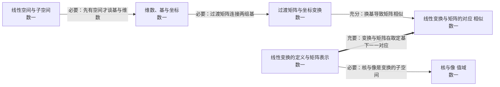

# 附录 线性空间与线性变换

> 数一/数三 要求（数一常以小题出现）；数二 不考。核心：基、维数、坐标变换与线性变换的矩阵表示。

## 知识点清单

| 知识点 | 层次 | 一句话要点 |
| --- | --- | --- |
| [[线性空间与子空间]] | `数一` | 满足八条运算法则的集合称线性空间（向量空间）；对加法与数乘封闭的非空子集称子空间。 |
| [[维数、基与坐标]] | `数一` | 线性空间中极大无关组称基，其向量个数称维数；向量在基下的表示系数称坐标。 |
| [[过渡矩阵与坐标变换]] | `数一` | 两组基满足 (β₁,…,βₙ) = (α₁,…,αₙ)P，P 称过渡矩阵且必可逆；坐标满足 x = Py 或 y = P⁻¹x。 |
| [[线性变换的定义与矩阵表示]] | `数一` | T(kα+lβ)=kT(α)+lT(β)；在给定基下 T 对应唯一矩阵 A，且 T(α) 的坐标 = A·α 的坐标。 |
| [[线性变换与矩阵的对应（相似）]] | `数一` | 同一线性变换在两组基下的矩阵 A、B 满足 B = P⁻¹AP，即相似。 |
| [[核与像（值域）]] | `数一` | ker T = {α ｜ T(α)=0} 是子空间；Im T 也是子空间；dim ker T + dim Im T = dim V（秩定理）。 |

## 本章关系图（Mermaid）

## 跨章连接（本章与外部的充分必要关系）

| 起点 | 关系 | 终点 | 含义 |
| --- | --- | --- | --- |
| [[相似对角化的方法与步骤]] | 🟩 关联 | [[线性变换与矩阵的对应（相似）]] | 对角化是换基观点的特例 |
| [[线性变换与矩阵的对应（相似）]] | 🟥 充要 | [[相似矩阵的定义]] | 相似即同一变换在不同基下的矩阵 |
| [[核与像（值域）]] | 🟧 充分 | [[齐次方程组的通解与解空间]] | 核即齐次方程组的解空间 |
| [[维数、基与坐标]] | 🟩 关联 | [[向量组的秩]] | 维数是基所含向量个数 |
| [[线性空间与子空间]] | 🟧 充分 | [[向量的内积、长度与正交]] | 内积空间是线性空间的加强 |
| [[线性变换与矩阵的对应（相似）]] | 🟧 充分 | [[矩阵合同]] | 同一变换 + 正交基 ⇒ 正交合同 |

## Obsidian 双链版关系（供图谱 view 使用）

- [[相似对角化的方法与步骤]] ⇒ 🟩 关联 ⇒ [[线性变换与矩阵的对应（相似）]]——对角化是换基观点的特例
- [[线性变换与矩阵的对应（相似）]] ⇒ 🟥 充要 ⇒ [[相似矩阵的定义]]——相似即同一变换在不同基下的矩阵
- [[核与像（值域）]] ⇒ 🟧 充分 ⇒ [[齐次方程组的通解与解空间]]——核即齐次方程组的解空间
- [[维数、基与坐标]] ⇒ 🟩 关联 ⇒ [[向量组的秩]]——维数是基所含向量个数
- [[线性空间与子空间]] ⇒ 🟧 充分 ⇒ [[向量的内积、长度与正交]]——内积空间是线性空间的加强
- [[线性变换与矩阵的对应（相似）]] ⇒ 🟧 充分 ⇒ [[矩阵合同]]——同一变换 + 正交基 ⇒ 正交合同

---

返回：[[00 线性代数知识网总览]]
